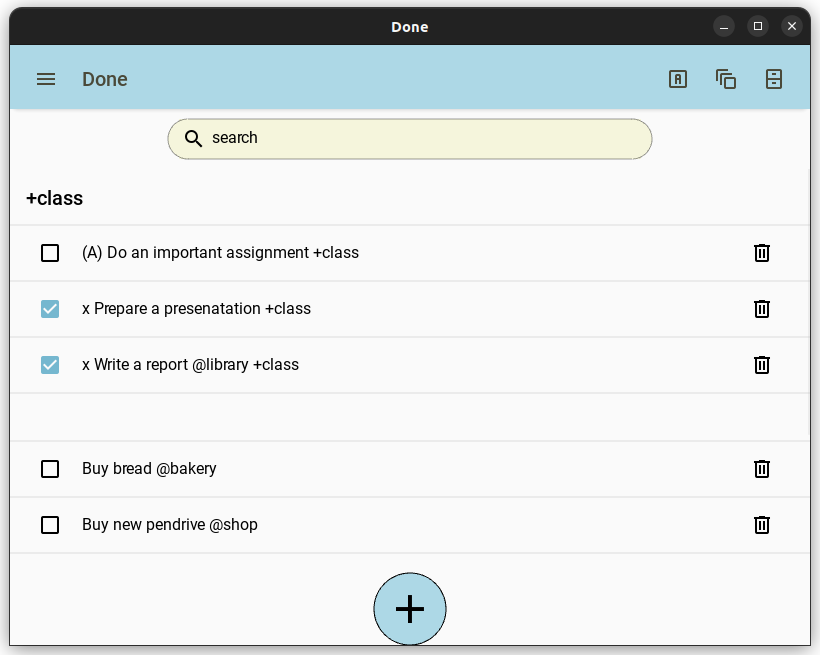

# Done
Minimalistic keyboard-driven desktop application for managing tasks and projects in [todo.txt](https://github.com/todotxt/todo.txt) format

# Description
Application provides simplistic yet pretty graphical user interface for easier managment of tasks in provided text file formatted by the rules of the todo.txt.
Goal of this project is to provide the unnecessary functionality and smooth usage with addition of good looking themes.
Motivation was not being able to find a compromise between looks, functionality and keyboard-driven approach in other existing apps.

Application is written in Python with kivy and kivyMD library.

As of right now app, while providing full basic functionality, is not fully yet developed and there are possible features to add.

# Installation
To run the app you must have [Python](https://www.python.org/) installed on your computer. It is assumed that [git](https://git-scm.com/) is installed and working.

## Windows installation

### Go to desired installation place
In this example desktop will be used
~~~
cd %userprofile%\Desktop
~~~
### Clone the project
~~~
git clone https://github.com/MarcinKadziolka/Done
~~~
### Enter created directory
~~~
cd Done
~~~
### Create new virtual environment
#### - Using venv
~~~
python -m venv done_venv
~~~
#### - Using virtualenv
~~~
virtualenv done_venv
~~~
### Activate the environment
~~~
done_venv\Scripts\activate
~~~
After activating environment you should see name of your virtual environment preceeding command line, for example:
~~~
(done_venv) computer@ubuntu:~/Desktop/Done$
~~~
### Install all dependencies from requirements.txt file
~~~
pip install -r requirements.txt
~~~
### Run the app
~~~
python done.py
~~~
### After finishing using the app, deactivate the environment
~~~
deactivate
~~~
## Linux installation
### Go to desired installation place
In this example desktop will be used
~~~
cd ~/Desktop
~~~

### Clone the project
~~~
git clone https://github.com/MarcinKadziolka/Done
~~~
### Enter created directory
~~~
cd Done
~~~
### Create new virtual environment
#### - Using venv
~~~
python3 -m venv done_venv
~~~
#### - Using virtualenv
~~~
virtualenv done_venv
~~~
### Activate the environment
~~~
source done_venv/bin/activate
~~~
After activating environment you should see name of your virtual environment preceeding command line, for example:
~~~
(done_venv) computer@ubuntu:~/Desktop/Done$
~~~
### Install all dependencies from requirements.txt file
~~~
pip install -r requirements.txt
~~~
### Run the app
~~~
python3 done.py
~~~
### After finishing using the app, deactivate the environment
~~~
deactivate
~~~
# Usage
Application provides functionality basic functionality such as adding, editing and deleting tasks. App allows to prioritize tasks, tag them and to collect them in projects. Search bar allows for quickly finding tasks. All functionality is achievable with shortcuts.
## Basic functionality
### Selecting tasks
To select tasks use up and down arrow keys or use mouse to perform actions. Selected tasks text will appear in red.
### Adding tasks
To add task click the "+" button or press `Ctrl+Shift+a` and an input field will popup. After typing in task press Enter to add task to list. The input field is in fast adding mode meaning it doesn't dismiss itsel after adding task. To exit press Esc key two times.
### Editing tasks
To edit task click on it or select it and press `Ctrl+Shift+e` and an editing field will popup. Press enter to save changes.
### Deleting tasks
To delete task click on trash icon or select it and press `Ctrl+Shift+d`.
## Sorting
### Priority
Priority is given by writing a capital letter in parenthesis before task description
~~~
(B) Write a README.md for Done project
~~~
Priority will make task appear on top of the list. Strength of priority is measured alphabetically so A > B ... > Z
### Tags
Tag is every word that begins with a '@' character. Tasks can have zero, one or more tags and they are used to group tasks together.
~~~
Wish grandma a happy birthday @call
~~~
### Projects
Project is every word that begins with a "+" character. Tasks can have zero, one or more projects and they are used to group tasks together.
~~~
Prove that real part of every nontrivial zero of the Riemann zeta function is 1/2 +math101
~~~
### Sorting by priority
To sort by priority click first icon in upper right corner or press `Ctrl+Shift+1`. Tasks will be sorted by: 
1. Completion status 
2. Priority 
3. Alphabetical order 
### Sorting by tags
To sort by tags click second icon in upper right corner or press `Ctrl+Shift+2`. Tasks will be grouped together by their tags. Tags are sorted alphabetically. Tasks without any tags will be displayed last. Within tag groups tasks are sorted like priority sort.
### Sorting by projects
To sort by projects click second icon in upper right corner or press `Ctrl+Shift+3`. Tasks will be grouped together by their projects. Projects are sorted alphabetically. Tasks without any projects will be displayed last. Within projects groups tasks are sorted like priority sort.
### Searching
To search tasks click on the search bar or press `Ctrl+Shift+s`. Only the tasks that contain substring provided will be displayed.

# Troubleshooting
If app crashes on start try deleting settings.txt that is stored in app installation directory.
